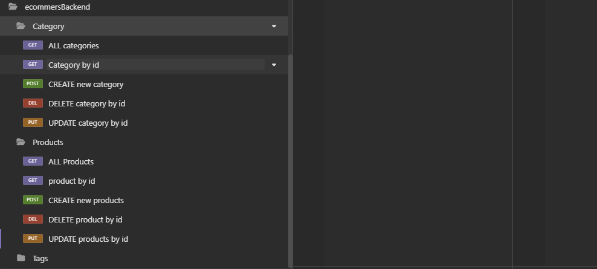
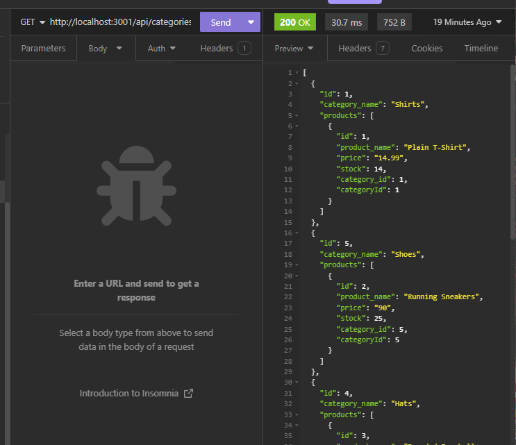

  # ecommerce_back_end

  ## Muhsin Tarik Orgerim

  ## Table of Contents
  - [Description](#description)
  - [Usage](#usage)
  - [License](#license)
  - [Credits](#credits)
  - [Contribute](#contribute)
  

  ## Visuals
  
  
 

  # Description
  A server/app that provides backend functionality for an ecommerce business.

  ## Usage
  Can be used to handle the serve side of an ecommerce business.

  ## Installation
  N/A

  ## Credits
  - Rutgers Bootcamp Resources.

  ## Contribute
  - Create a fork of the project
  - Create your branch
  - Make sure to commit your changes
  - Push the branch
  - Do a Pull Request

  ## Deployment
  - Link to my repo: https://github.com/tarikorg/ecommerce_back_end
  - Deployed link: [WALKTHROUGH](https://drive.google.com/file/d/1wxT2gRiGyHnvAtmBNb_Vdy7Iy6wK-NF3/view?usp=sharing)
   
  ## Questions
  - Github username: https://github.com/tarikorg
  - Email: myku1771@gmail.com

  ## License
  This repository is under the MIT license.

